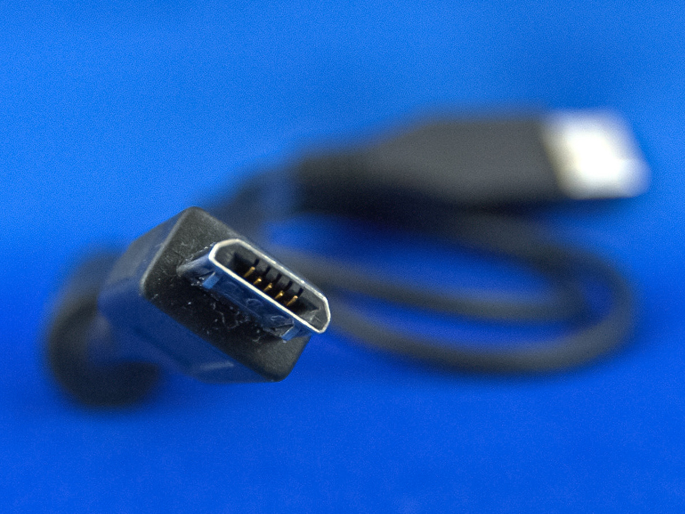

# Understanding USB
## Why this cable works, and that one doesn't

Henry Marshall

2019-03-11

==========

## USB Spec

---------

## Not Just 1 Spec

----------

* Ports
* Data
* Charging

==========

## Ports

----------

TODO Slide Upside Down

----------

## USB A

----------

## USB B

----------

## USB C

----------

## Micro USB

==========

## Data

----------

| Version         | Marketing Name           |
| --------------- | ------------------------ |
| USB 2.0         | High Speed  (480 Mbit/s) |
| USB 3.0         | SuperSpeed  (5Gbit/s)    |
| USB 3.1         | SuperSpeed+ (10 Gbit/s)  |
| USB 3.2         | SuperSpeed+ (20 Gbit/s)  |
| USB4 (upcoming) | SuperSpeed+ (40 Gbit/s)  |
| Thunderbolt 3   |                          |
| DisplayPort     |                          |

----------

| Version         | 2013-01       | 2017-07         |
| --------------- | ------------- | --------------- |
| USB 2.0         |               |                 |
| USB 3.0         | USB 3.1 Gen 1 | USB 3.2 Gen 1   |
| USB 3.1         | USB 3.1 Gen 2 | USB 3.2 Gen 2   |
| USB 3.2         |               | USB 3.2 Gen 2x2 |
| USB4 (upcoming) |               |                 |
| Thunderbolt 3   |               |                 |
| DisplayPort     |               |                 |

----------

## Manufacturer's 
## Don't Care

Note: I will use 3.0, 3.1, and 3.2

----------

TODO Spec Sheets

==========

## Where the Trouble Starts

----------

## Ports

| Version            | A     | B     | C     | Micro |
| ------------------ | ----- | ----- | ----- | ----- |
| USB 2.0            |       |       |       |       |
| USB 3.0            |       |       |       |       |
| USB 3.1            |       |       |       |       |
| USB 3.2            | x     | x     |       | x     |
| USB4 (upcoming)    | x     | x     |       | x     |
| Thunderbolt3 (TB3) | x     | x     |       | x     |
| DisplayPort (DP)   | x     | x     |       | x     |

----------

## USB A 3.x is Blue

----------

## USB B 3.x

----------

## Micro USB 3.x

----------

## USB C ???

Note:
- I wrap in elec tape
- MBP comes with 2.0

----------

## Thunderbolt 3

Note: 4 lane vs 2 lane

----------

## Ports

| Version            | A     | B     | C     | Micro |
| ------------------ | ----- | ----- | ----- | ----- |
| USB 2.0            | Black | Small | ???   | Small |
| USB 3.0            | Blue  | Big   | ???   | Big   |
| USB 3.1            | Blue  | Big   | ???   | Big   |
| USB 3.2            | x     | x     | ???   | x     |
| USB4 (upcoming)    | x     | x     | ???   | x     |
| Thunderbolt3 (TB3) | x     | x     | Bolt  | x     |
| DisplayPort (DP)   | x     | x     | ???   | x     |

==========

## Graceful Degredation

----------

## Lowest Common Denominator

- Host
- Peripheral
- Cable

Note: Cables can partially break

==========

## Why Protocols Matter

----------

## Speed

Note: Demo TB3 transfer & USB 2.0 Transfer + Magic Trick

----------

## Alt Mode DP Monitors

----------

## External GPU

==========

## Charging

----------

## Watt = Volt * Amp

Note: Watt is ultimately what matters

----------

## 10W = 5V * 2A

----------

TODO Pictures of how chargers are labeled

Note: Many do not say `Watt` anywhere

----------

| Open Standard             | Maximum Power                |
| ------------------------- | ---------------------------- |
| USB 2.0                   | 2.5W = 5V at 0.5A            |
| USB 3.0                   | 4.5W = 5V at 0.9A            |
| Battery Charging v1.2     | 25W  = 5V at 5A (Typical 2A) |
| Power Delivery (PD)       | 100W = 5/9/15/20V at 5A      |

Note: 
- PD requires USB C
- HT to Google & Motorola for using PD

----------

| Proprietary Standard      | Maximum Power                 |
| ------------------------- | ----------------------------- |
| Quick Charge 1.0          | 10W = 5V at 2A                |
| Quick Charge 2.0          | 18W = 5/9/12V at 3A           |
| Quick Charge 3.0          | 18W = 3.6-20V at 2.5/4.6A     |
| Quick Charge 4.0+         | QC: 18W = 3.6-20V at 2.5/4.6A |
|                           | PD: 27W = 5/9V at 3A          |
| Samsung AFC ~== QC 2.0    | 18W = 5/9V at 1.67/2A         |
| One Plus WC 30            | 30W = 5V at 6A                |
| Huawei SC 2.0             | 40W = 5/9/10V at 2/4A         |
| Oppo VOOC 2               | 50W = 5V at 10A               |

Note: 
- All implement Battery Charging 1.2
- QC is backwards compatible
- Samsung AFC ~== QC 2

----------

## Lowest Common Denominator

- Charger
- Device
- Cable

Note: Cable ~only relevant for 2A+

==========

## First Party is Best

----------

## Power Meter

==========

## An Aside on Batteries

Note: Partial discharges are better for longevity

==========

Assets

- [USB A 2.0](https://it.wikipedia.org/wiki/File:USB_Type-A_plug_coloured.svg)
- [USB B 2.0](https://it.wikipedia.org/wiki/File:USB_Type-B_plug_coloured.svg)

- USB A 2.0: Vahid alpha at [English Wikipedia](https://en.wikipedia.org/wiki/File:Usb_head_Cable.jpg)
- USB A 3.x: Rainer Knäpper, [Free Art License](http://artlibre.org/licence/lal/en/)
- Micro USB 3.0: Rainer Knäpper, [Free Art License](http://artlibre.org/licence/lal/en/)
- USB B 3.0: Anıl Öztaş
- USB C: Max Pixel
- USB C with Laptop: Maurizio Pesce
- Thunderbolt 3: Amin on [Wikimedia](https://commons.wikimedia.org/wiki/File:Thunderbolt_3_Cable_connected_to_OWC_Thunderbolt_3_Dock.jpg)